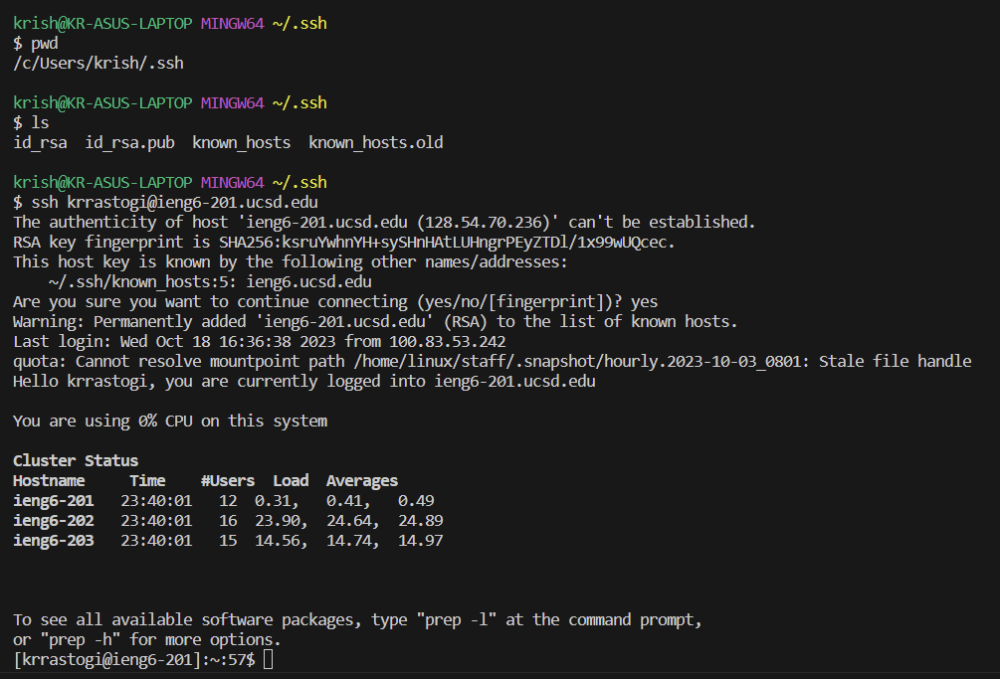

# Lab Report

## Part 1
    import java.io.IOException;
    import java.net.URI;
    import java.util.ArrayList;

    class Handler implements URLHandler {
        // The one bit of state on the server: a number that will be manipulated by
        // various requests.
        int num = 0;
        ArrayList<String> searchlist = new ArrayList<String>();

        public String handleRequest(URI url) {
            if (url.getPath().equals("/")) {
                String temp = "";
                for (int i = 0; i < searchlist.size(); i++){
                    temp = temp + searchlist.get(i) + "\n";
                }
                return temp;
            }
            else if (url.getPath().contains("/search")) {
                    String[] parameters = url.getQuery().split("=");
                    if (parameters[0].equals("s")) {
                        String tempstring = "";
                        //tempstring += String.format("" + searchlist.contains(parameters[1])) + "\n";
                        for (int i = 0; i < searchlist.size(); i++){
                            if (searchlist.get(i).contains(parameters[1])){
                                tempstring += searchlist.get(i) + "\n";
                            }
                        }
                        return tempstring; 
                    }
            } else {
                if (url.getPath().contains("/add-message")) {
                    String[] parameters = url.getQuery().split("=");
                    if (parameters[0].equals("s")) {
                        searchlist.add(parameters[1]);
                        return String.format("Added " + parameters[1] + " to the list" + "\n" + searchlist);
                    }
                }
                return "404 Not Found!";
            }
            return "404 Not Found!";
        }
    }

    class StringServer {
        public static void main(String[] args) throws IOException {
            if(args.length == 0){
                System.out.println("Missing port number! Try any number between 1024 to 49151");
                return;
            }

            int port = Integer.parseInt(args[0]);

            Server.start(port, new Handler());
        }
    }

## Part 2

> 

## Part 3

In these last two weeks, I have learned how to ssh into remote machines and start server using that machine. I also have now learned that the sites that I can create can use the URL as commands and how to use these items in the url to make the server do a certain task.
